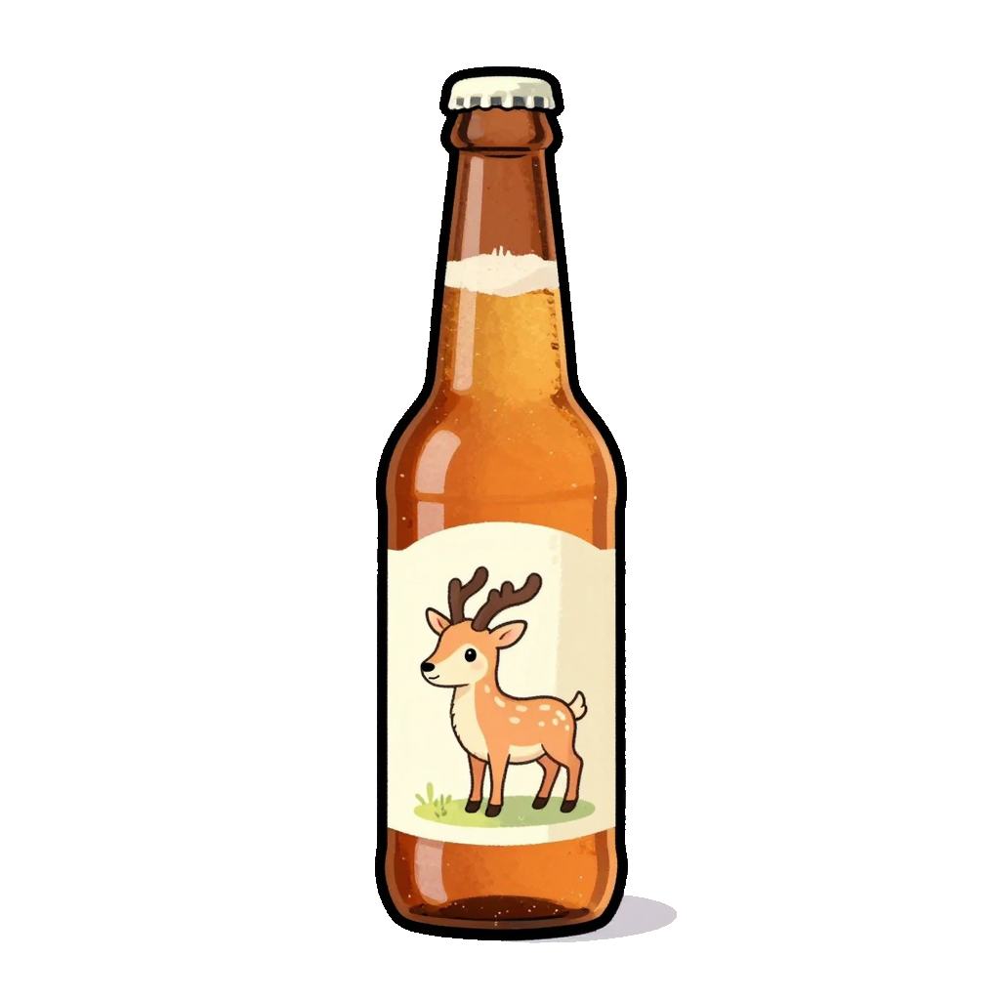

<div align=center>

</div>

# Stubby Scripts

Collection of short scripts/applications, designed to be run via `uv`.

## Prerequisites

You need to have `uv` installed on your system. If you don't have it installed, you can install it using:

```bash
brew install uv
```

Or follow the official installation guide at [https://github.com/astral-sh/uv](https://github.com/astral-sh/uv)

## Usage

Run any script directly from the URL using `uv run`:

```bash
uv run https://noraincheck.github.io/stubby/convert_pdf.py
uv run https://noraincheck.github.io/stubby/youtube_dl.py
uv run https://noraincheck.github.io/stubby/qr_generator.py
```

Alternatively, you can clone this repository and run the scripts locally:

```bash
git clone https://github.com/noraincheck/stubby.git
cd stubby
uv run convert_pdf.py
uv run youtube_dl.py
uv run qr_generator.py
```

## Local Development

For local development, you can create a virtual environment:

```bash
uv venv
source .venv/bin/activate
```

Then run the scripts with:

```bash
uv run convert_pdf.py
```

The scripts are designed to be run via `--script` mode, so if dependencies need to be added it is done via:

```sh
uv add $MY_PACKAGE --script $MY_SCRIPT
```

From a style perspective, use PyQt5 for interfaces
